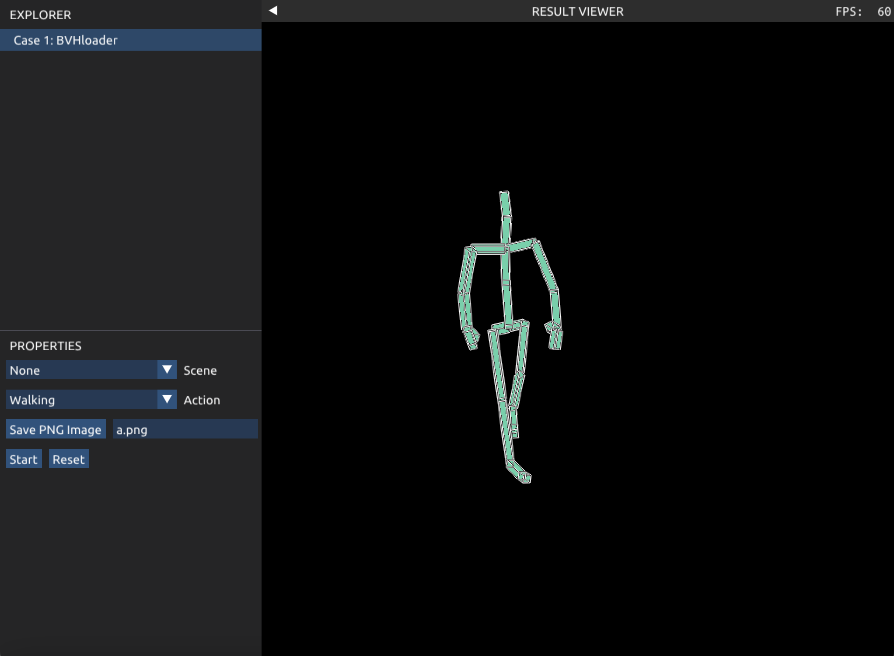
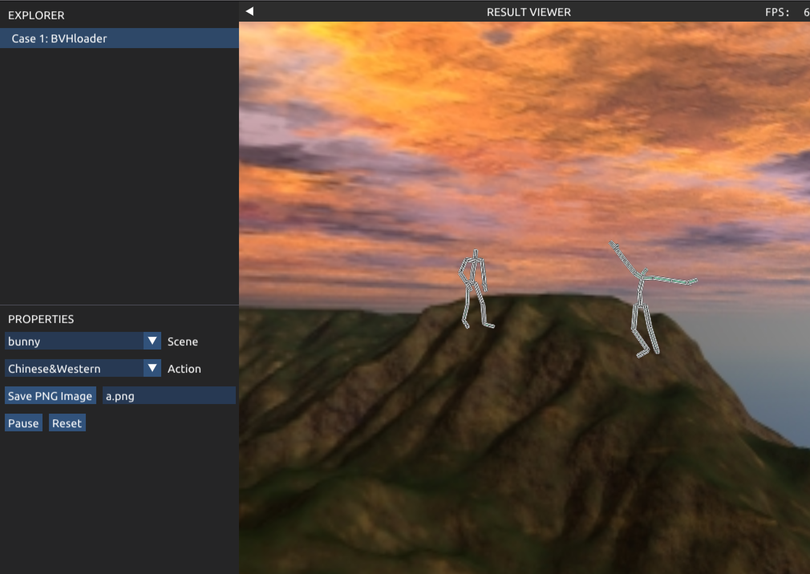
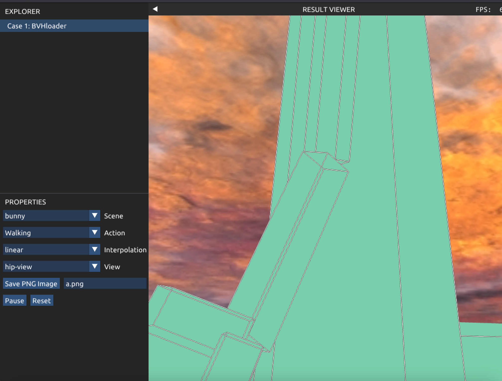

# VCL 2023 - Report for Final Project

This project was completed based on the framework, code, and assets provided in VCL Lab3 and Lab4.

The BVH data is sourced from: https://mocap.cs.sfu.ca/

You can type the following commands in the terminal:

```
xmake
xmake run Final_Project
```

Then, select different BVH files on the left to see the visual results.

In `BVH.h` and `BVH.cpp`, I created the `Joint` class and `BVH` class.
The former is used to store the name, relationship, and data of individual joints, 
while the latter is used to store the entire BVH file's Root pointer and motion-related information such as frame count, 
duration per frame, and data arrays. The `load_from_file()` function is used to load BVH files, 
recursively processing each joint and reading in all data. Subsequently, the `next_frame()` function determines whether it is time for the next frame, 
and in each frame, the transformation matrix of the joints is calculated using `calc_joint()`. 
The coordinates of each joint are then obtained through the `get_positions()` function and passed back to the main program using the vertices and indices arrays. 
The final skeleton shape is rendered using the interface provided by lab4's `BoxRenderer::arms`, clearly showing the length of each joint and its nodes.



However, it was noted that the frame rate specified in the BVH file is often lower than the calculated frame rate, 
resulting in slight lag. 
I attempted to address this issue with preloading and precomputing (`pre_loading()` function), 
but found that after preloading, rendering each frame only improved by approximately 1-2 ms on average, 
indicating that the main bottleneck still lies in rendering. You can adjust the default parameter for preload in `CaseBVHloader.h` to `True` to observe the performance of preloading.

My program can handle BVH files with multiple Root joints 
(for example, you can select "Chinese&Western" to see two people simultaneously performing Chinese and Western dances, 
which I generated by merging motion data from two files into one multiple-root file). 
It can also handle files with different Euler angle orders for channels, demonstrating good robustness. 
Additionally, the background can be changed (utilizing Lab3's Skybox).



## Animation Transition

During the transition between two actions/keyframes, 
an algorithm is needed to generate natural transitional states. 
For visualization, I added two functions for smooth BVH transitions on top of the BVH Loader functionality. 
When selecting another BVH file in the selection box, 
the system transitions from the current state to the initial state of the next BVH file through a transitional process. 
Here, we only discuss cases where the total data channels of the two BVH files before and after are the same. 
Otherwise, manual selection of key joints such as Head and Shoulder would be required, 
which is cumbersome, and since there are plenty of BVH files with identical channels on the website, it was not implemented.

The most straightforward approach is to interpolate each value of the data over the transitional frames. 
When selecting "Linear", you can observe the result of this approach. 
In most cases, such as those in my files, as long as the source/target files being switched do not involve the "Walking" option, 
the transition is relatively smooth. 
Apart from the unrealistic sliding steps,
the movements of various joints of the human body look very realistic. However, 
when it involves walking, there is a significant body rotation, greatly affecting the visual experience.

Specifically, the body rotates 180 degrees in the Y-axis direction. While it could simply rotate along the Y-axis, after the Euler angle XYZ rotation compound and interpolation, the phenomenon of significant body rotation occurs. Initially, I attempted to rotate along the Y-axis in the earlier frames, and then interpolate the XZ-axis in the latter half of the Transition. However, this did not solve the problem. After analysis and research, this might be attributed to Euler angle "gimbal lock" phenomenon, wherein when the middle axis of Euler angles (in this case, the Y-axis) is close to 90 degrees, the influence of X and Z axes is magnified. So, I attempted to interpolate only the Y-axis for the beginning and end frames, and interpolate XZ for the middle frames, which did improve in some cases, but led to an overall unnatural appearance.

However, recalling the smoother interpolation claimed by quaternion interpolation, I decided to try quaternions first, using spherical linear interpolation. Selecting "quat" allows you to view the results of quaternion spherical interpolation. After quaternion interpolation, some cases did indeed look better, but the effect of transitioning actions involving walking worsened. It shouldn't be an implementation issue, because the transitions of other actions were still relatively smooth, and only those close to 90 degrees on the Y-axis caused severe shaking. After analysis, it seems that during interpolation, if the Y-axis target value is close to 90 degrees / -90 degrees, "Singularities" occur, leading to significant changes in the XZ-axis during spherical interpolation, resulting in severe shaking. Linear interpolation does not exhibit this issue because XZ is already close to the target state.

So, I sought a more universal and powerful solution. Noticing that a rotation represented by one set of Euler angles can at least be represented by another set of Euler angles, one approach is to try to first convert Euler angles into rotation matrices, then decompose the matrices to find two sets of corresponding Euler angles with small differences and the Y-axis far from 90 degrees. Essentially, this reconstructs the rotation process, making it simpler and avoiding significant rotations. However, I have not yet succeeded in implementing this. Hopefully, with further improvement in mathematical abilities and knowledge of computer graphics, I can continue to address this issue in the future.


## Appendix: A Useless but Interesting Function

The scene of Chinese and Western dancers dancing under the sunset in the screenshot seemed quite beautiful. 
I had the sudden idea of wanting to see the world through the eyes of the dancers. 
So, I added the function to switch the "View". 
Specifically, if a scene (not None) is selected and the View is switched to head-view or hip-view, 
you can see the skybox world from the corresponding joint perspective. 
This function is implemented by modifying the view matrix of the Camera. 
Unfortunately, due to poor alignment of the axes, the final perspectives were mostly facing the sky
(hip-view was slightly better, resembling a camera on a person's leg), 
but you could still see the direction of the perspective changes, creating a sense of immersion (especially when viewing the Chinese Dance-turn from head-view).



# VCL 2023 – Report for Final Project

我的选题是Animation里的BVH Loader和Animation Transition。

这个Project在VCL Lab3和Lab4的框架和代码和素材基础上完成。

BVH数据来源：https://mocap.cs.sfu.ca/

要查看效果，可在终端中输入

```
xmake
xmake run Final_Project
```

然后在左侧选择不同动作的`BVH`文件查看可视效果。

## BVH Loader

​	在`BVH.h`和`BVH.cpp`中，我创建了`Joint`类和`BVH`类，前者用于存储单个关节的名字、关系以及数据，后者用于存储整个BVH文件的全部`Root`指针和`Motion`相关信息，比如帧数、每帧时长和数据数组。通过`load_from_file()`函数可以加载BVH文件，递归地处理每个关节，读入全部数据。之后，通过`next_frame()`函数判断是否到下一帧的时间，并在每一帧通过`calc_joint()`计算关节的变换矩阵，再通过`get_positions()`函数得到每个关节的坐标并通过`vertices`和`indices`数组传递回主程序，利用`lab4`的`BoxRenderer::arms`渲染的接口来绘制出最终的骨骼形状，可以清晰看见关节长与各个关节节点。


​	不足的是，通过实验发现，bvh文件标明的每帧时间经常小于计算每一帧的时间，这样就会略显迟缓。我尝试使用预加载、预计算来解决这个问题(`pre_loading()`函数)，但是发现预加载后，再每帧渲染，平均提升了仅约1-2ms的延迟表现，说明主要的瓶颈还是在于渲染。可以通过更改`CaseBVHloader.h`里的`preload`默认参数为1来查看预加载的表现。

​	我的程序可以处理带有多个`Root`的BVH文件(例如，可以选择Chinese&Western，看两个人同时跳起中西方舞蹈，这个是我将两个文件Motion数据合在一起生成的多Root文件)。还可以处理`channels`带有不同欧拉角顺序的文件，具有良好的鲁棒性。同时，可以更换背景(借用了Lab3的Skybox)。


## Animation Transition

​	在两个动作/关键帧过渡的过程中，需要算法生成自然的过渡态。为了可视化，我在BVH Loader的功能之上增加了两个BVH顺滑切换的功能，当在选择框选择另一个BVH文件时，可以通过过渡的过程从当前状态切换到下个BVH文件的初始状态。首先我们这里只讨论前后两个BVH文件的总数据channels相同的情况，否则可以根据两个数据来源，手动挑选关键关节如Head, Shoulder等进行处理，但是过于繁琐，而且我这里channels相同的BVH文件比较丰富，所以没有实现。

​	最直接的做法是将数据每个值对过渡的帧数插值。**选中`Linear`时**切换BVH文件可以看到这样做法的结果。在大多数情况下，如我的文件中，只要切换的源/目标文件不涉及Walking选项，就比较顺滑，并且除了滑步不符合物理规律以外，人体各个关节的动作看着非常真实。但是如果涉及Walking，就会发生大幅度的身体翻转，严重影响观感。

​	具体来说，身体在Y轴方向旋转180度，本来可以直接Y轴上旋转，但是经过欧拉角XYZ方向旋转的复合，再经过插值，就出现了这种身体大幅度翻转的现象。首先我尝试在前面的帧中先转Y轴，到Transition的后半部分再插值XZ轴。但是并没有解决问题。经过分析与查找资料，这个可能属于欧拉角“抖动”现象，具体来说当欧拉角中间轴(在这里是Y轴)比较接近90度时，X与Z的影响会放大。于是我尝试将头和尾只插值Y轴，中间插值XZ，在一些情况下确实得到了改善，但是却会造成整体的不自然。

​	但是回想起四元数插值更加光滑的说法，我决定先用四元数，使用球面线性插值。选择`quat`的时候可以查看四元数球面插值的结果。四元数插值后一些Case看起来确实变得更好了，但带有Walking的动作切换，效果却变得更差了，应该不是实现的问题，因为其他动作切换时还是比较顺滑的，只有Y轴接近90度的会导致剧烈抖动。经过分析，具体来看是插值的过程中，若Y轴目标值接近90度/-90度，会出现"Singularities"问题，经过球面插值，XZ轴出现大幅改变，出现剧烈抖动的现象。而如果采用线性插值就不会出现这种情况，因为XZ已经接近目标状态。

​	于是我寻求一种更加通用且更加强大的解决方法。注意到一组欧拉角表示的旋转至少可以被另外一组欧拉角表示，于是有一种思路是尝试先将欧拉角转换为旋转矩阵，再分解矩阵找到两组对应差距较小且Y轴离90度较远的欧拉角。这样的做法本质上是重构了旋转的过程，使得更加简单且没有大幅度旋转。但是目前我还没有成功实现。希望以后随着数学能力和图形学知识的进一步提升我可以继续解决这一问题。


## Appendix: A Useless but Interesting Function

​	当时截屏中西方舞者在夕阳下起舞的画面，感觉还挺美的。突发奇想想要看看舞者眼中的世界。于是我加入了切换`View`功能，具体来说，如果选择了场景(不为None)，且切换View为head-view或hip-view就可以看见对应关节视角中的skybox世界。这个功能通过修改Camera的view矩阵实现。可惜由于坐标轴对齐非常不良好，最终视角基本都是朝着天空的(hip-view会好一点，比较像人腿上的摄像机)，但是还是可以看见人的视角变换的方向，有一种身临其境的感觉(尤其是从head-view看Chinese Dance-turn)。


